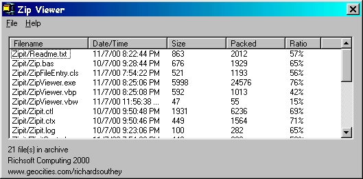



## Add ZIP compression/decompression to your apps with Richsoft ZipIt 1b

### Description

An ActiveX Control to add zip archive functionality to your applications.

 

* Add, extract and delete files from standard zip archives.

 

* Get file information about the contents of the archive.

 

* Supports 9 levels of compression

 

* Fully event driven

 

Contains a WinZip style application showing how to use the control.

 

Please visit my website for more information.

 

www.richsoftcomputing.btinternet.co.uk
 
### More Info
 
See readme file before using the control.

Still in beta so expect some error messages

             |
---                |---
**Submitted On**   |2000-10-20 18:17:34
**By**             |[Richard Southey](https://github.com/Planet-Source-Code/PSCIndex/blob/master/ByAuthor/richard-southey.md)
**Level**          |Intermediate
**User Rating**    |4.7 (47 globes from 10 users)
**Compatibility**  |VB 5\.0, VB 6\.0
**Category**       |[Files/ File Controls/ Input/ Output](https://github.com/Planet-Source-Code/PSCIndex/blob/master/ByCategory/files-file-controls-input-output__1-3.md)
**World**          |[Visual Basic](https://github.com/Planet-Source-Code/PSCIndex/blob/master/ByWorld/visual-basic.md)
**Archive File**   |[CODE\_UPLOAD155222262001\.zip](https://github.com/Planet-Source-Code/richard-southey-add-zip-compression-decompression-to-your-apps-with-richsoft-zipit-1b__1-21251/archive/master.zip)

